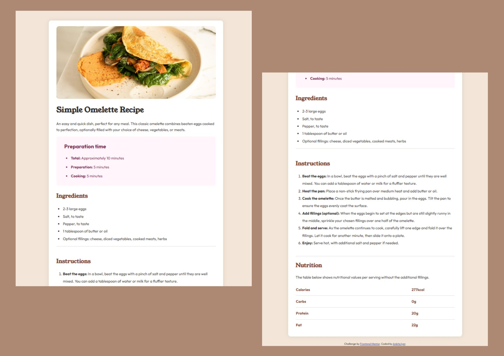

# Frontend Mentor - Recipe page solution

## Table of contents

- [Overview](#overview)
  - [The challenge](#the-challenge)
  - [Screenshot](#screenshot)
  - [Links](#links)
- [My process](#my-process)
  - [Built with](#built-with)
  - [What I learned](#what-i-learned)
  - [Continued development](#continued-development)
  - [Useful resources](#useful-resources)
- [Author](#author)
- [Acknowledgments](#acknowledgments)


## Overview

This project is a newbie Frontend Mentor HTML5 + CSS3 challenge to build a recipe main page. 

### Screenshot



### Links

- Solution URL: [Recipe Main Page Solution](https://www.frontendmentor.io/solutions/responsive-mobile-first-html5-css3-recipe-main-page-kTEcNT2pFe)
- Live Site URL: [Recipe Main Page Website](https://thecerebralcosmocrat.github.io/Recipe-Main-Page/)

## My process

1. I initialized my project as a public repository on [GitHub](https://github.com). Creating a repo makes it easier to share my code with the community and allows potential employers to gauge my learning process and curve.
2. I looked through the desktop design, mobile design, index.html, style-guide.md and preview.jpg to begin brainstorming ways to tackle the project. This helped me think ahead for CSS classes to create reusable styles. 
3. Before adding any styles, I structured the content using semantic HTML. Writing the HTML first helps me focus on creating well-structured content first and worrying about the styling later. 
4. I wrote out the basic styles for my project, including general content styles, such as `font-family` and `font-size`. In this case, I had to embed the HTML code for the fonts `Young Serif` and `Outfit` from [Google Fonts](https://fonts.google.com/).
5. I began CSS by adding styles to the containers on the top of the page and worked my way down. I moved on to the next section only when I was happy or satisfied with the previous section. 
6. I made a commit to the project repository at each and every savepoint/flag. I consider every working state of the project to be a savepoint/flag. This way, I can rollback to any previous working state in case my code breaks or ceases to function properly. Writing good commit messages is also of prime importance. Mentioning the changes made to the code at the end of each session is a good practice. Looking through GitHub code blames isn't always fun. 
7. When the project is done, use GitHub pages for deployment :)

### Built with

- Semantic HTML5 markup
- CSS custom properties
- Flexbox
- CSS Grid
- Mobile-first workflow

### What I learned

```html
Here's some HTML code I'm proud of:

  <link rel="preconnect" href="https://fonts.googleapis.com">
  <link rel="preconnect" href="https://fonts.gstatic.com" crossorigin>
  <link href="https://fonts.googleapis.com/css2?family=Young+Serif&display=swap" rel="stylesheet"> 
  
I enjoyed the part where I embed the fonts to the HTMl page. Learning about preconnect was also cool.
```
```css

.nutrition-details table {
    margin-left: 0px;
    margin-right: auto;
    border-collapse: collapse;
    color: hsl(14, 45%, 36%);
    font-weight: 700;
    width: 100%;
}
```

### Continued development

The main area I'd like to focus on is the responsiveness and interactivity of my webpages. I'm using only plain HTML and CSS as of now. I definitely need to get used to padding and margins. And Flexbox and CSS Block + Grid properties. It's a long journey ahead!

### Useful resources

- [MDN Docs](https://developer.mozilla.org/en-US/) - This is easily the most quessential resource for learning the syntax and use of various HTML elements and CSS properties. Literally officially the reference bible for web development. 
- [The Markdown Guide](https://www.markdownguide.org/) - This is an amazing resource which finally helped me understand markdown syntax and usage. I never knew learning something as overlooked as markdown could be enjoyable! The README.md file is actually very important, as it tells people the story of your project :)

## Author

- Frontend Mentor - [@thecerebralcosmocrat](https://www.frontendmentor.io/profile/thecerebralcosmocrat)

## Acknowledgments

I'd love to thank [Scrimba](https://scrimba.com) for their supercool HTML + CSS course! It really helped boost my confidence in coding independently and trusting my intuition when it comes to frontend development. 
